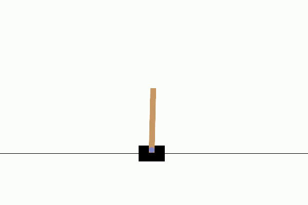
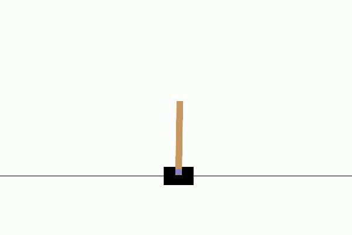
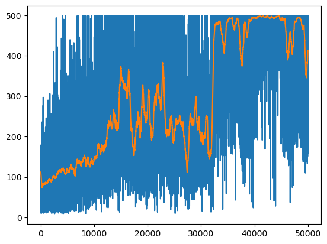

# Cartpole-Qlearning
Implementation of Q-learning on OpenAI's Gym (Gymnasium 0.26), with descriptions


---
<table>
<tr>
    <td></td>
    <td></td>
</tr>
<tr>
    <td align="center">Learned Agent</td>
    <td align="center">Random Agent</td>
</tr>
</table>

##### Rewards Plot

The plot below illustrates the agent's reward progression over time:


---

## Description

This project implements Q-learning, a fundamental reinforcement learning algorithm, to solve the classic CartPole problem from OpenAI's Gym environment. The CartPole environment is a benchmark task in reinforcement learning where the objective is to balance a pole on a moving cart by applying forces to the cart.

The agent learns to maximize the total reward by interacting with the environment, observing its state, and taking actions guided by a learned Q-table. Through iterative updates, the agent improves its decision-making to keep the pole balanced for as long as possible.

This project demonstrates the core principles of reinforcement learning, including:

* Discretization of the state space for tabular Q-learning.
* Exploration-exploitation trade-off using an epsilon-greedy policy.
* Visualization of agent performance through reward plots and environment renders.

The results include visualizations of the agent's learning process and its performance over time. This project serves as a starting point for understanding reinforcement learning fundamentals and applying them to real-world problems.

---

## Usage and Installation

To set up the project, follow these steps:

1. 
    ```bash
    git clone https://github.com/milwd/Cartpole-Qlearning.git
    ```
2.
    ```bash
    cd Cartpole-Qlearning
    ```
3. 
    ```bash
    pip install -r requirements.txt
    ```


Use the Jupyter Notebook provided.

